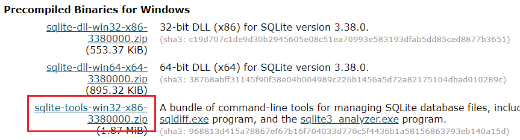
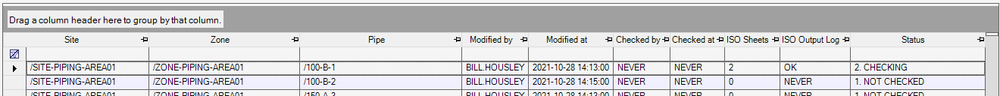
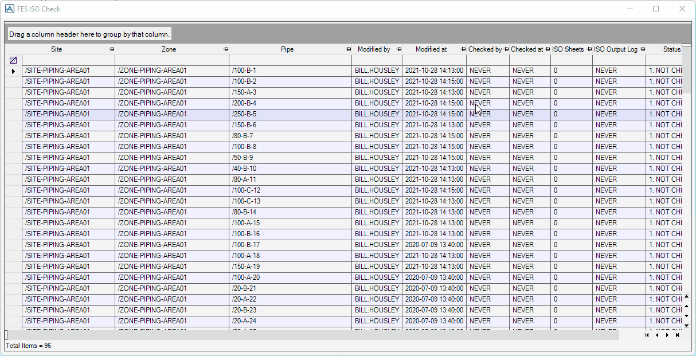
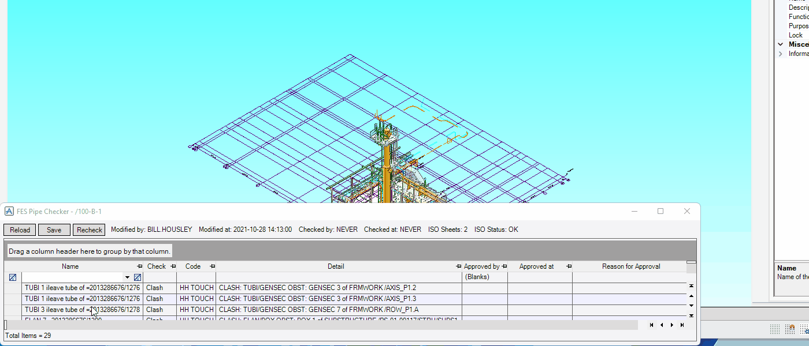
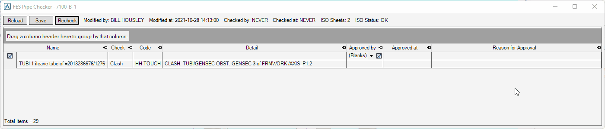
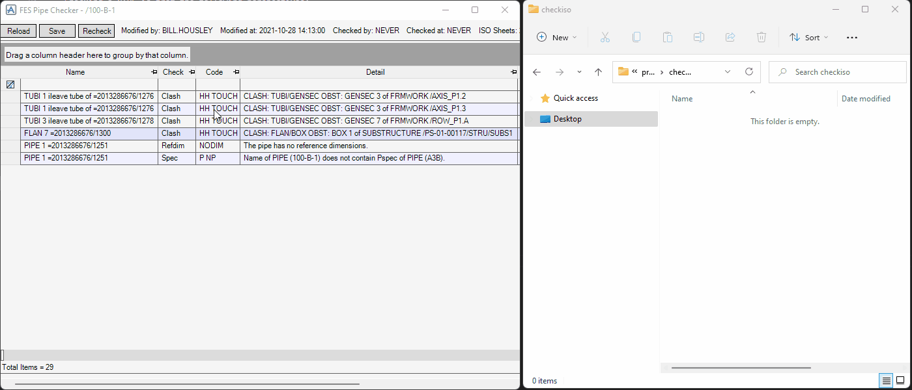
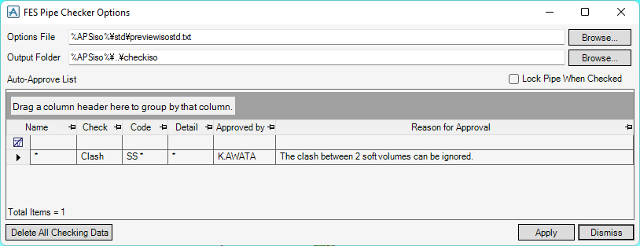

# ISO Check

**ISO Check** checks PIPEs whether they are fine to output isometric drawings.

## Requirements

ISO Check macro needs `sqlite3.exe` in the [SQLite command-line tools](https://www.sqlite.org/download.html).



To use the macro, follow these steps:

1. Download the ZIP file `sqlite-tools-win32-x86-<any version>.zip`.
2. Extract the ZIP archive.
3. Put `sqlite3.exe` from the ZIP in the directory `<Your pmllib folder>\sqliteorm\bin\`.

## Getting Started

Enter the following command in the **Command Window**:

```pml
show !!fescheck
```

## Features

### All PIPEs Summary

The table shows all the PIPEs in writable DBs.



- **Site**, **Zone**, **Pipe**

  Their names

- **Modified by**

  Username who modified the PIPE last time

- **Modified at**

  Date and time when modified the PIPE last time

- **Checked by**

  Username who completed checking the PIPE last time

- **Checked at**

  Date and time when completed checking the PIPE last time

- **ISO Sheets**

  Number of the output ISO drawing sheets

- **ISO Output Log**

  Error log for output ISO drawings last time

- **Status**

  Progress of checking the PIPE that expresses by the following status:

  1. **NOT CHECKED**

     The PIPE has never been checked.

  2. **CHECKING**

     The PIPE has been checked, but it still has errors.

  3. **CHECKED**

     The PIPE has been checked, and it has no errors, or all the errors are approved.

  4. **MODIFYING**

     You are modifying the PIPE right now even though it finished checking.

  5. **UPDATED**

     The PIPE has been modified since it finished checking.

### Checking PIPE

To check a PIPE, right-click a row in the table, and then select **Open Pipe Checker**.



- Checking a PIPE is from the following perspectives:

  - Data consistency check
  - Clash check
  - Check whether there are inconsistent SPECs between the PIPE, BRANs, and the components
  - Check whether set the reference dimensions in the PIPE

- Navigation in the 3D view to a selected element in the errors table

  

### Approving Error

You can approve an errors instead of solving them by fixing the PIPE.



!> To complete checking after approving all the errors, click the **Recheck** button.

### Outputting ISO Drawings

When the macro checks a PIPE, it also outputs the ISO drawings.



!> If the PIPE still has errors, the macro writes `DRAFT` on the ISO drawings.

## Configuration

To open the setting form, enter the following command in the **Command Window**:

```pml
show !!feschecksettings
```



- **Options File**

  Options file to output isometrics drawings

- **Output Folder**

  Folder where output isometrics drawings

- **Lock Pipe When Checked**

  If true, the macro locks a PIPE when it has finished checking the PIPE with no errors, or all the errors are approved.

- **Auto-Approve List**

  If an error of checking PIPEs matches with **Name**, **Check**, **Code**, and **Detail** of any row in this list, the error is automatically approved with the values of **Approved by** and **Reason of Approval**.

  !> You can use the wildcard characters `*` in the values of **Name**, **Check**, **Code**, and **Detail**.
