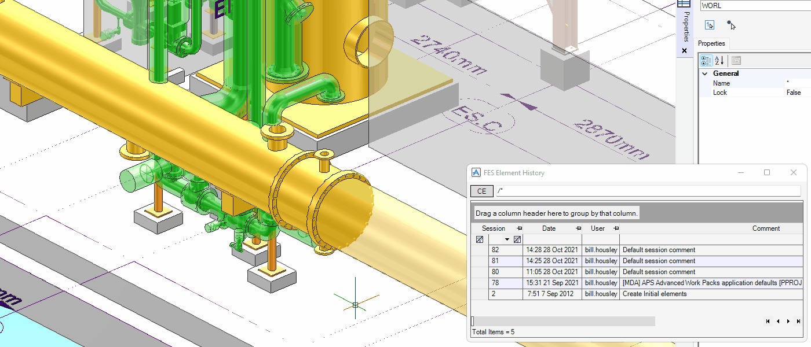
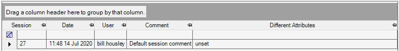

# Element History

**Element History** reverts an element at the savework of a specified time.

## Getting Started

Enter the following command in the **Command Window**:

```pml
show !!feshistory
```

## Features

### Reverting Element



1. Set CE to an element you want to revert.
2. Click the **CE** button in the form.
3. Right-click a row in the table.
4. Select **Revert**.

### Sessions Table



- **Session**

  Identification number of the savework

- **Date**

  Date when did the savework

- **User**

  Username who did the savework

- **Comment**

  Comment by a user who did the savework
