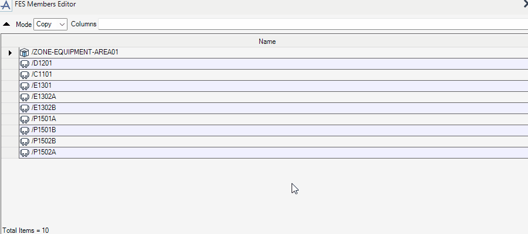
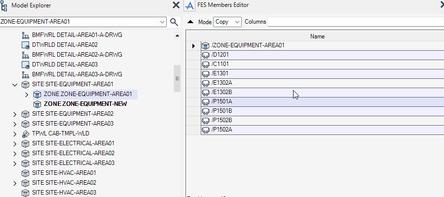
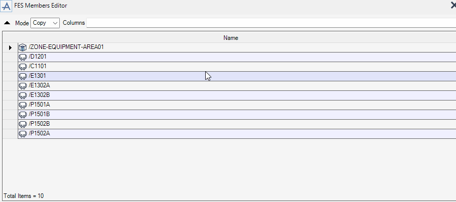

# Members Editor

**Members Editor** reorders CE members, moves them to an other element, modifies their attributes, deleting them, etc.

## Getting Started

Enter the following command in the **Command Window**:

```pml
show !!fesmember
```

## Features

### Hierarchy Control

- Copy Elements

  

- Move Elements

  

### Editing Attributes

You can add columns of the members table with the same way as the **Columns** textbox in the [Quick Report](/mac/fesrep/?id=collecting-elements).


