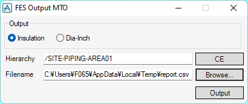

# Output MTO

**Output MTO** outputs a report for quantities of items related piping.

## Getting Started

Enter the following command in the **Command Window**:

```pml
show !!fesmto
```

## Usage



- **Output**

  Type to output

- **Hierarchy**

  Top hierarchy to output items below

- **Filename**

  Filename of the output file
