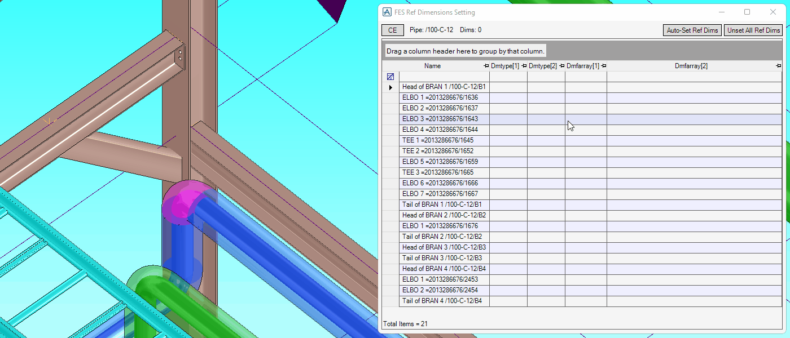

# Pipe To Grid

**Pipe To Grid** shows dimensions from a component to the nearest grid lines in the isometric drawings.

## Getting Started

Enter the following command in the **Command Window**:

```pml
show !!fespipe2grid
```

## Features

### Pipe List


- Show the number of reference dimensions currently set of each PIPE
- Open the reference dimensions setting form
- Set or unset reference dimensions from each PIPE to the nearest grid lines

### Reference Dimensions Setting



- Set or unset reference dimensions at a specified component or a branch end
- Show dimensions from elements to referenced elements in the 3D view
