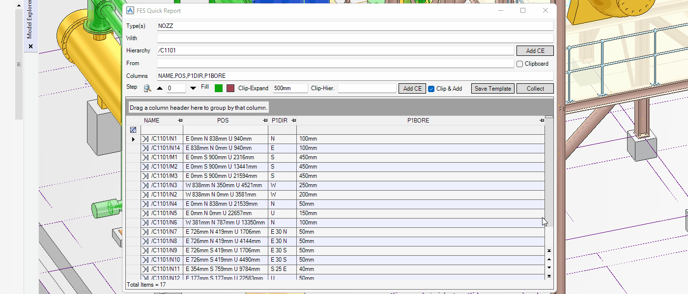

# Quick Report

**Quick Report** lists elements and their attributes of database using a specified condition.

## Getting Started

Enter the following command in the **Command Window**:

```pml
show !!fesrep
```

## Features

### Collecting Elements


- **Type(s)**

  Enter element types you want to collect. If empty, it indicates all types.

- **With**

  Enter **PML logical expression** to filter the collected elements.

- **Hierarchy**

  Enter owner element names that have elements to collect. If empty, it indicates the whole MDB.

- **From**

  Enter special filtering syntax. If the **Clipboard** checkbox is selected, only elements in the clipboard are collected.

- **Columns**

  Enter column names separated by commas `,`. The valid column names are **attribute** names, **pseudo attribute** names, or **PML expression**. In addition, the following notations are available:

  - `{n-m}`

    `n` = First number, `m` = Last number

    When used this notation, the column repeats `m` minus `n` times, but the parts of that notation are replaced by the numbers from `n` to `m`.

  - `<xxx>`

    `xxx` = Alias

    Adding this notation after a column expression, it can name a column an alias to display. If used asterisk `*` between brackets `<` and `>`, `*` will be replaced the repeat numbers of the above notation.

  For example:

  ```pml
  POS[{1-3}]<座標 *>
  ```

  The above column will be expanded as follows:

  ```pml
  POS[1]<座標 1>,POS[2]<座標 2>,POS[3]<座標 3>
  ```

### Editing Attributes

If the column is just an attribute with a not calculated value, you can modify the value in the table.


### Exporting Report to Excel

To export the report, right-click the table, and then select **Export to Excel**.



### Saving Collection Condition

You can save entered values in the form to a file. To load them again, drag that file to the **Command Window**.


### Reviewing Each Collected Element

- Navigation to each collected elements in 3D view
- Filling rows in the table with green or red color


