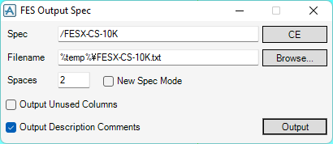

# Output Spec

**Output Spec** outputs a SPECON input file from a specified SPEC with more beautiful aligned columns than the standard outputting.

## Getting Started

Enter the following command in the **Command Window**:

```pml
show !!fesspecdump
```

## Usage



- **Spec**

  SPEC to output

- **Filename**

  Filename of the output file

- **Spaces**

  Number of spaces to separate columns of the output file

- **New Spec Mode**

  If true, the output file format is for a NEW spec.

- **Output Unused Columns**

  If true, columns with only `=0` are also output.

- **Output Description Comment**

  If true, comments of the description on the ISO drawing are added after the end of each row.
