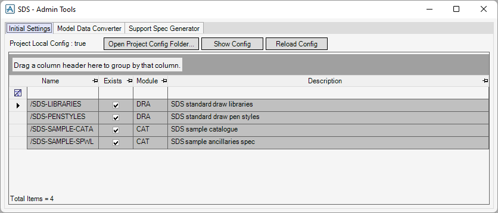
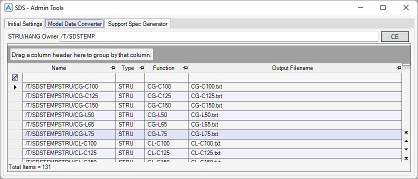
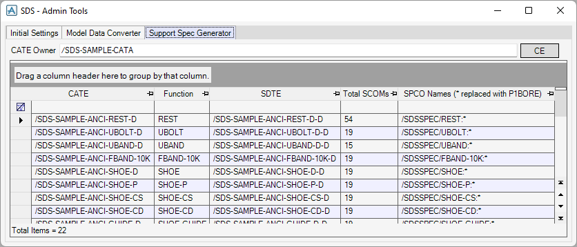

# Admin Tools Form

## Form Controls

### Initial Settings Tab

- **Project Local Config**

  If this is true, the local `sdsconfig.csv` exists in this project, otherwise it does not.

- **Create Project Config Folder**

  To copy the `SDSConfig` folder from the `%PMLLIB%` directory to the `%<project>DFLTS%` directory, click this button.

  !> For details of the `SDSConfig` folder, see [Configuration Directory](config-dir.md#configuration-directory).

- **Open Project Config Folder**

  To open the `SDSConfig` folder, click this button. It is available when **Project Local Config** is true.

- **Show Config**

  To open a form to inspect the config, click this button.

- **Reload Config**

  To reload the config, click this button.

- **DB Outputs Table**

  There are DB output files on this table. To import the DB output file, select the row > right-click on the table > click **Import**.

  !> For details of the DB output file, see [DB Output Files Definition File](config-dir.md#db-output-files-definition-file).

### Model Data Converter Tab

- **STRU/HANG Owner**

  To show the `STRU` and `HANG` elements to convert on the table, enter the element that owns them in this box. To enter the CE, click **CE** next to this box.

- **Model Data Table**

  To convert the elements to text files, select the rows > right-click on the table > click **Output**. If the type is `STRU`, the file is saved in the same folder as [Framework Types Definition File](config-dir.md#framework-types-definition-file). Otherwise, if the type is `HANG`, the file is saved in the same folder as [Hanger Types Definition File](config-dir.md#hanger-types-definition-file). The output filename is the same as the `Function` attribute followed by `.txt`.

### Support Spec Generator Tab

- **CATE Owner**

  To show the ancillary `CATE` elements to generate the SPCO elements on the table, enter the element that owns them in this box. To enter the CE, click **CE** next to this box.

- **Categories Table**

  To generate the SPCO elements from the `CATE` elements into `SupportSpec`, select the rows > right-click on the table > click **Add to SPEC**. The `SPCO` names are `<SupportSpec>/<Function of CATE>:<P1BORE of SCOM>`.
