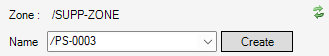
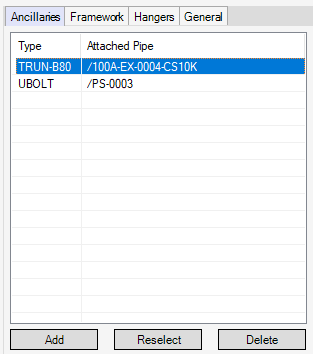
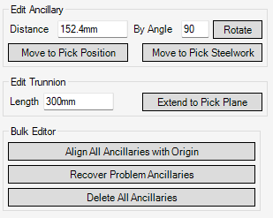
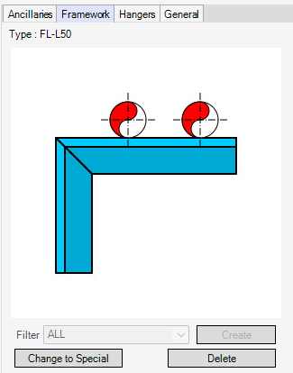
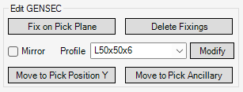
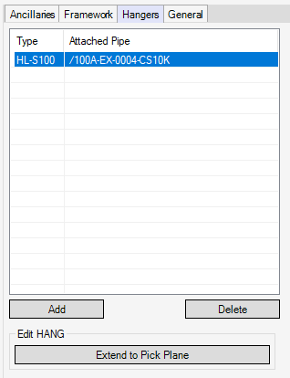
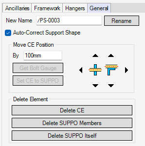

# Design Form

## Form Controls

- **Name**

  To navigate to the desired support, select the `SUPPO` element from this box.

- **Create**

  To create a new `SUPPO` element in the current `ZONE` element, and name it the entered name in the **Name** box, click this button. If `(Auto Name)` is entered in the **Name** box, the new `SUPPO` is named from a naming pattern of the existing `SUPPO` in the current `ZONE`.

- :arrows_counterclockwise: **Reload this form**

  When `sdsconfig.csv` is updated, or the form is uncontrollable due to an unexpected error, to reload the form, click this button.

### Ancillaries Tab

- **Add**

  To create a new ancillary, click this button > pick a piping in the 3D view > select an ancillary type.

- **Reselect**

  To change the selected ancillary type, click this button.

- **Delete**

  To delete the selected ancillary, click this button.

- **Distance**

  To move the selected ancillary, enter a distance from the previous element of the attached piping element in this box.

- **Rotate**

  To rotate the selected ancillary about the same axis as the attached piping, enter the angle in the **By Angle** box and click this button.

- **Move to Pick Position**

  To move the selected ancillary to a position through the desired position, click this button and pick the position in the 3D view.

- **Move to Pick Steelwork**

  To move the selected ancillary to a position on the desired steel section, click this button and pick the steel section in the 3D view.

- **Length**

  To change the selected trunnion length, enter the length in this box.

- **Extend to Pick Plane**

  To extend the selected trunnion to the desired plane, click this button and pick the plane in the 3D view.

- **Align All Ancillaries with Origin**

  To align all ancillaries in the current `SUPPO` element with the support origin, click this button.

- **Recover Problem Ancillaries**

  To recover the problems that all ancillaries in the current `SUPPO` element have, click this button. The recovery steps are as follows:

  - Search for the missing `Compref` attributes.
  - Delete and re-create all the ancillaries' members.
  - Move all the ancillaries to new positions through the previous positions.

- **Delete All Ancillaries**

  To delete all ancillaries in the current `SUPPO` element, click this button.

### Framework Tab

- **Create**

  To create a framework of the current `SUPPO` element, click this button and select a framework type. Using the **Filter** drop-down list can filter the option of the selection form.

- **Change to Special**

  To change the framework type of the current `SUPPO` element to the special, click this button. SDS doesn't automatically adjust the special supports.

- **Delete**

  To delete the framework of the current `SUPPO` element, click this button.

- **Fix on Pick Plane**

  To extend an end of the selected `GENSEC` element to the desired plane, and to create a baseplate to the end, click this button > pick the plane in the 3D view > select a base plate type.

- **Delete Fixings**

  To delete the fixing elements of the selected `GENSEC` element, click this button.

- **Mirror**

  If this is selected, the selected `GENSEC` element is flipped.

- **Modify**

  To modify the steel profile of the selected `GENSEC` element, select a new profile from the **Profile** drop-down list and click this button.

- **Move to Pick Position Y**

  To move the selected `GENSEC` element to the desired position, click this button and pick the position in the 3D view. The `GENSEC` can move only on the **Y-axis** of the owner `STRU` element's position.

- **Move to Pick Ancillary**

  To move the selected `GENSEC` element to a new position where the desired ancillary is put on, click this button and pick the ancillary in the 3D view.

### Hangers Tab

- **Add**

  To create a new hanger, click this button > pick an ancillary or a steelwork in the 3D view > select a hanger type.

- **Delete**

  To delete the selected hanger, click this button.

- **Extend to Pick Plane**

  To extend the selected hanger to the desired plane, click this button and pick the plane in the 3D view.

### General Tab

- **Rename**

  To rename the current `SUPPO` element, enter a name in the **New Name** box and click this button.

- **Auto-Correct Support Shape**

  If this is selected, whenever anything in the current `SUPPO` element changes, SDS automatically adjusts the `GENSEC` length and the ancillaries' positions.

- **Move CE Position**

  To offset the CE element's position, enter an offset distance in the **By** box and click any of the arrow buttons. For the direction to move, compare the steelwork's flange in the 3D view with the icons surrounded the arrow buttons.

- **Get Bolt Gauge**

  To enter the bolt gauge line of the selected ancillary on a steelwork in the **By** box, click this button.

- **Set CE to SUPPO**

  To navigate to the owner `SUPPO` element of CE, click this button.

- **Delete CE**

  To delete CE, click this button.

- **Delete SUPPO Members**

  To delete the current `SUPPO` element's members, click this button.

- **Delete SUPPO Itself**

  To delete the current `SUPPO` element itself, click this button.
