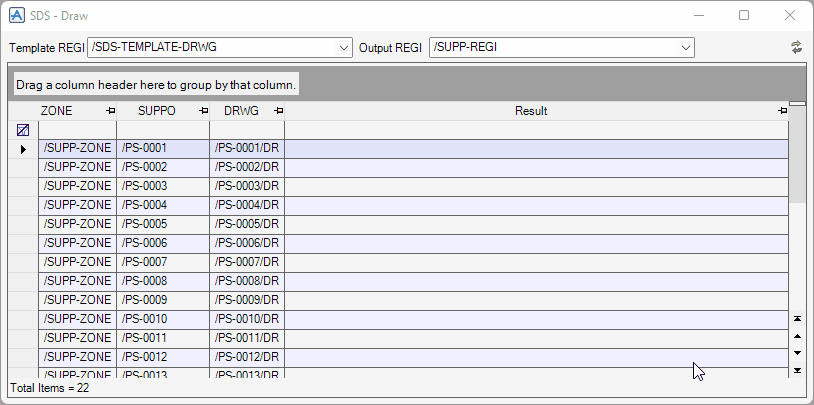

# Draw Form

## Form Controls

- **Template REGI**

  When generating the drawings, the selected template in this drop-down list is used.

  !> For details of the template `REGI` element, see [Template Registry](template-format.md#template-registry).

- **Output REGI**

  When generating the drawings, they are saved to the selected `REGI` element in this drop-down list.

- :arrows_counterclockwise: **Refresh this form**

  To refresh all the form controls, click this button.

- **Supports and Drawings Table**

  This table populates all supports in the 3D model.

### Right-click Menu on Table

- **Open Sheet**

  To open the selected drawing, click this one.

- **Draw**

  To generate the drawings from the selected support, click this one.

- **Draw by Step**

  To execute one step of generating the drawing, click an item in this sub-menu.

  !> For details of the steps of generating the drawing, see [Generating Drawing Methods](#generating-drawing-methods).

- **Output MTO**

  To output the MTO table of the selected support as a **CSV** file, click this one.

- **Output PDF**

  To output the selected drawings as **PDF** files, click this one.

  !> The plot style is defined by the `OutputPltsty` option. For details, see [Configuration File](config-dir.md#configuration-file).

- **Export to Excel**

  To export this table to an **Excel** file (\*.xlsx), click this one.

- **Print Preview**

  To open the print preview, click this one.

### Generating Drawing Methods

- `.CreateDrwg()`

  Create the new `DRWG` element. If `DRWG` has the same name already exists, it is deleted before that.

- `.InitializeDrwg()`

  Copy the `DRWG` element and the members from the template `REGI`. If the `DRWG` already has members, they are deleted before that.

- `.SetSheetNoteTexts()`

  Set the sheet note texts such as the scale, the total weight, and the total surface area.

- `.SetViewDefinitions()`

  Set the view through positions, the view scales, and the local style rules.

- `.SetViewDirections()`

  Set the view directions.

- `.SetDrawLists()`

  Set the elements to draw.

- `.SetLimitPlanes()`

  Set the limit ranges of the views.

- `.SetOriginPoints()`

  Set the origin point symbols at the support origin.

  !> To set the support origin at your desired ancillary, set the `Number` attribute of the `ANCI` element to `-1`.

- `.SetOriginToGrid()`

  Set the dimensions from the origin to the nearest gridlines.

  !> The place to search for the nearest gridline is a `GRDREF` element where the origin is located. If the two or more `GRDREF` are applicable, the used `GRDREF` is the one with the smallest volume. The search ignores gridlines whose `IDPlane` attribute is `-`.

- `.DrawPipeEnds()`

  Draw cross-section symbols at the supported pipe that is running in the same direction as the view.

- `.DrawPipeNames()`

  Draw the supported `PIPE` element names.

- `.DrawDimensions()`

  Draw the dimensions for the support shape.

- `.DrawWeldSymbols()`

  Draw the symbols at all the field welding points except where they can be drawn in the detail-view.

- `.DrawMtoTable()`

  Draw the MTO table.

- `.DrawMtoNumbers()`

  Draw the MTO item No. on the isometric view.

- `.DrawForeignNames()`

  Draw the names of the foreign elements where the support is placed on the isometric view.

- `.DrawDetailViews()`

  Draw the detail-views for the base plates.

- `.UpdateSheet()`

  Update the `SHEE` element and the members.
