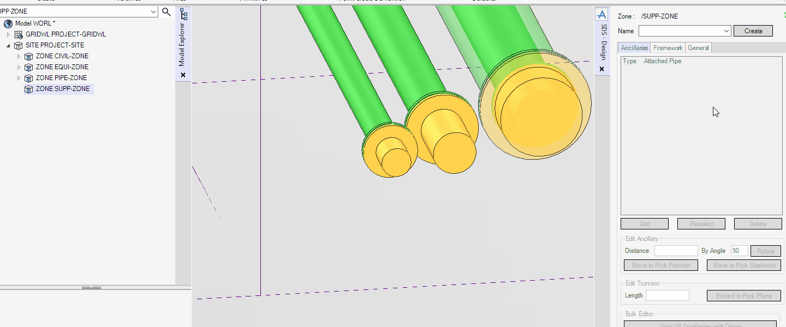
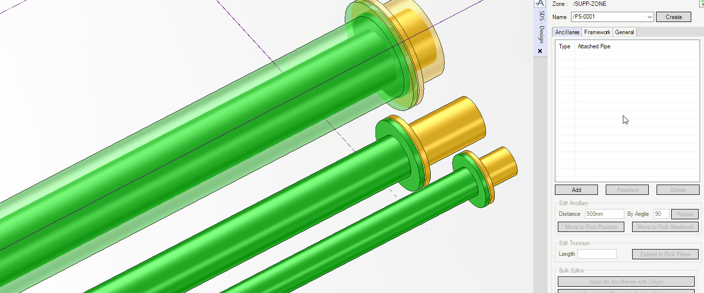
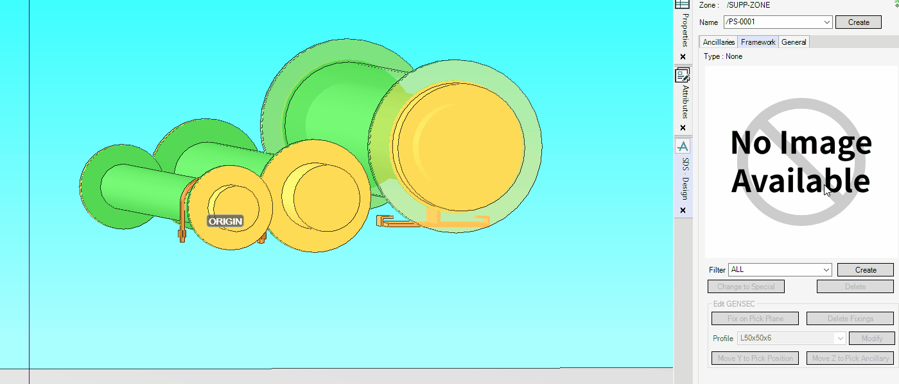
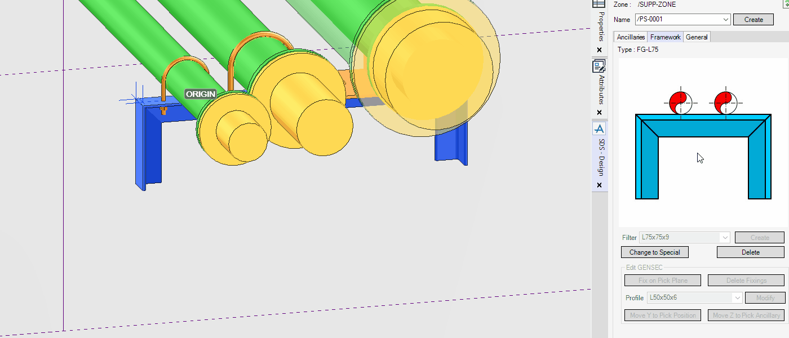
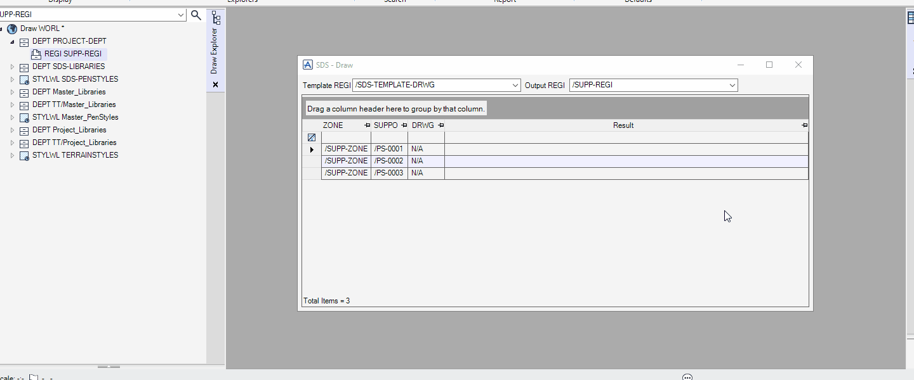

# Quick Start

## Open SDS Design Form

To open the SDS Design form, follow these steps:

1. Enter the **Model** module.

2. Run the following command from **Command Window**:

   ```pml
   show !!fessuppdes
   ```

   !> To open an SDS macro form besides using the command, ask your E3D administrator or see **_AVEVA E3D Design Help > SOFTWARE COSTOMISATION > .NET Customisation > Edit an UIC File_**

## Create SUPPO Element



To create a `SUPPO` element, follow these steps:

1. Create a new `ZONE` element to store `SUPPO` elements.

2. Enter a name to a new `SUPPO` in the **Name** box on the macro form.

   !> You can name `SUPPO` by using `(Auto Name)` instead of manually naming. That automatically names `SUPPO` from a naming pattern of the first `SUPPO` in the owner `ZONE` element.

3. Click <kbd>Create</kbd> next to the **Name** box.

## Create Support Ancillary



To create a support ancillary to the current support, follow these steps:

1. Click <kbd>Add</kbd> in the **Ancillaries** tab.

2. Pick a piping element or tubing in the 3D view, and then the **Select Ancillary Type** form is displayed.

3. Select an ancillary type from the list.

   !> The ancillary types shown in the list can depend on the condition of the `BRAN` element that owns the picked piping element.

4. Click <kbd>OK</kbd> on the selection form.

   !> If you have created the first ancillary of a `SUPPO` element, its position is at the arriving point of the picked piping element. To move the ancillary to the desired position, use the **Distance** box.

## Create Support Framework



To create a support framework to the current support, follow these steps:

1. Click <kbd>Create</kbd> in the **Framework** tab, and then the **Select Framework Type** form is displayed.

2. Select a framework type from the selection list.

   !> If there are too many options in the list, you can use the **Filter** drop-down list next to <kbd>Create</kbd> to reduce them.

3. Click <kbd>OK</kbd> on the selection form.

## Create Base Plate



To create a base plate to the current steel section, follow these steps:

1. Set a `GENSEC` element of a `SUPPO` to `CE`.

2. Click <kbd>Fix on Pick Plane</kbd> in the **Framework** tab.

3. Pick a plane, such as a floor, wall, or ceiling, in the 3D view, and then the nearest end of the `GENSEC` extends to the picked plane and the **Select Baseplate Type** form is displayed.

4. Select a base plate type from the selection list.

   !> The base plate types shown in the list can depend on the condition of the `GENSEC` element.

5. Click <kbd>OK</kbd> on the selection form.

## Open SDS Draw Form

To open the SDS Draw form, follow these steps:

1. Enter the **Draw** module.

2. Run the following command from **Command Window**:

   ```pml
   show !!fessuppdra
   ```

## Generate Support Drawing



To generate a support drawing, follow these steps:

1. Select a `REGI` element from the **Output REGI** drop-down list to store support drawings.

2. Select `SUPPO` elements whose drawing you want to generate from the table on the macro form.

3. Right-click on the table to open the menu, and then click <kbd>Draw</kbd> on the menu.
