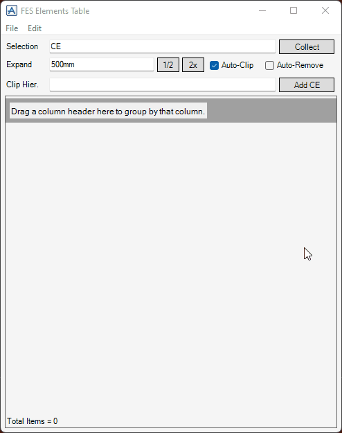
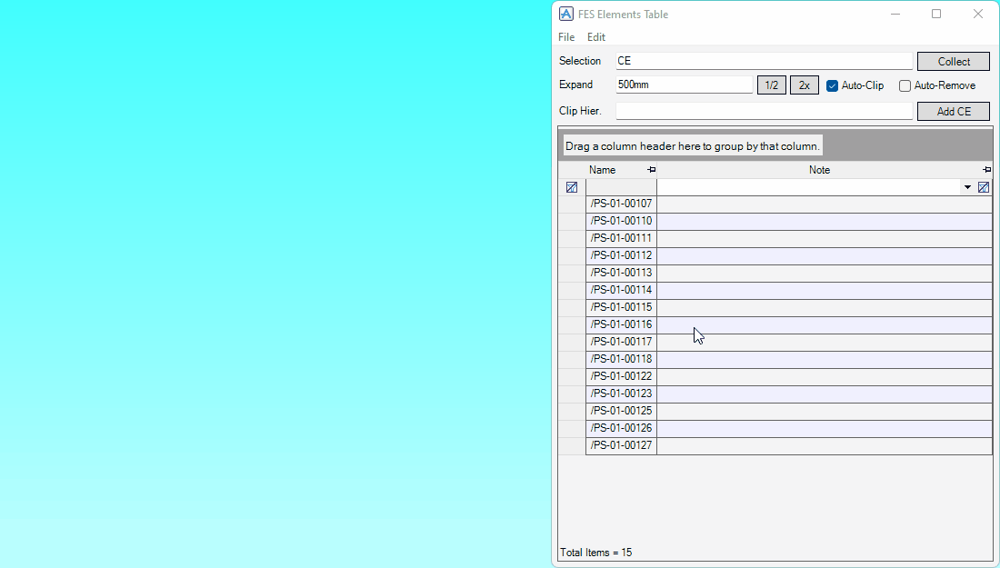
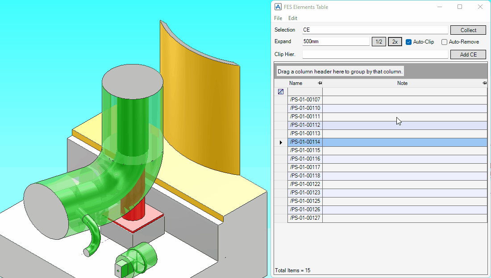

# Elements Table

**Elements Table** manages general purpose element lists writable columns and it can clip views with the selected rows.

## Getting Started

Enter the following command in the **Command Window**:

```pml
show !!festbl
```

## Features

### Appending New Elements

- Append new elements with the Selection textbox

  

- Append new elements from the clipboard

  

### Clipping Volume around Element



### Expand and Shrink Clipping Volume


