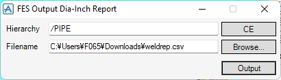

# Output Dia-Inch Report

**Output Dia-Inch Report** outputs a dia-inch report for counting the quantity of welding work.

## Getting Started

Enter the following command in the **Command Window**:

```pml
show !!fesweldrep
```

## Usage



- **Hierarchy**

  Top hierarchy to output welding points below

- **Filename**

  Filename of the output file

- **Output Direct Connection**

  If true, welding points that directly connect to something else are also output.

!> If you output them, you need to be careful not to double-count the number of welding points.
